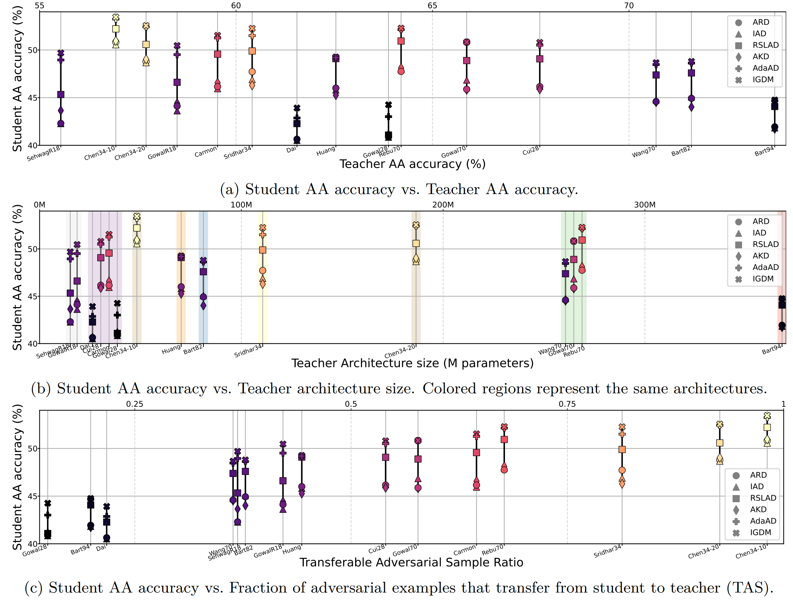

# Sample-wise Adaptive Weighting for Transfer Consistency in Adversarial Distillation

This repository contains the official implementation of the paper  
**"Sample-wise Adaptive Weighting for Transfer Consistency in Adversarial Distillation"**.

**TL;DR**

- Stronger robust teachers do not necessarily yield more robust students; the missing factor is **sample-wise adversarial transferability (TAS)** from student to teacher.
- We propose **SAAD (Sample-wise Adaptive Adversarial Distillation)**, which **up-weights transferable samples and down-weights non-transferable, high-variance samples** using a cheap entropy-based proxy.

<div align="center">
  
</div>

---

## Installation

All experiments in this repo were run with:

- Python 3.8
- PyTorch 2.1.0

Install the necessary packages using pip:

```bash
pip install torch>=2.1.0 torchvision numpy wandb
```

For loading pre-trained models as teacher model, we rely on **RobustBench**.
Please visit the official repository to download:

* **Official Repository:** [https://github.com/RobustBench/robustbench](https://github.com/RobustBench/robustbench)


---

## Supported Methods

This repository includes implementations of the following adversarial distillation methods:

| Method | Paper Title | Reference |
| :--- | :--- | :--- |
| **ARD** | Adversarially Robust Distillation | [link](https://arxiv.org/abs/1905.09747) |
| **RSLAD** | Revisiting Adversarial Robustness Distillation: Robust Soft Labels Make Student Better | [link](https://arxiv.org/abs/2108.07969) |
| **AdaAD** | Boosting Accuracy and Robustness of Student Models via Adaptive Adversarial Distillation | [link](https://openaccess.thecvf.com/content/CVPR2023/html/Huang_Boosting_Accuracy_and_Robustness_of_Student_Models_via_Adaptive_Adversarial_CVPR_2023_paper.html) |
| **IGDM** | Indirect Gradient Matching for Adversarial Robust Distillation | **(Ours)** [Link](https://arxiv.org/abs/2312.03286) |
| **SAAD** | **Sample-wise Adaptive Weighting for Transfer Consistency in Adversarial Distillation** | **(Ours)** |

---

## Quick Start
Run SAAD with the default configuration:

```bash
bash main.sh
```

## Contact

If you have questions about **IGDM** or **SAAD**, please feel free to open a GitHub issue.